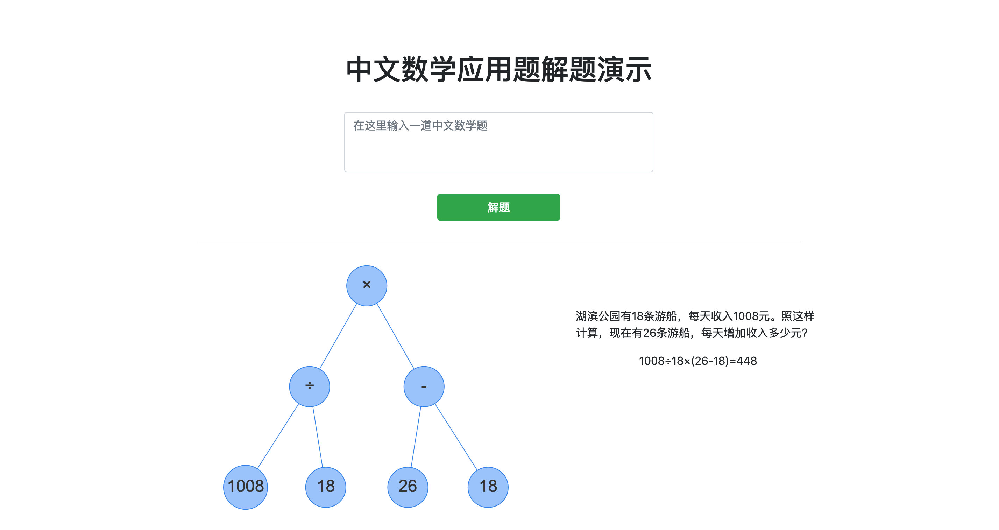
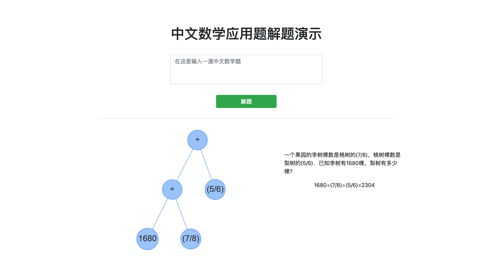

# Demo for Chinese Math Word Problem Solver

## Run 
1. create and activate virtual environment 
```
mkdir venv
cd venv
virtualenv -p python3 venv
source venv/bin/activate
```
2. install requirements
```
pip3 install -r reuiremnts.txt
```
3. run the application
```
sudo python app.py
```

## Requirements
- Python 3.6
- Flask 1.0.2
- Jieba
- PyTorch 1.0

## Technical details
- [visjs](http://visjs.org/) to show the expression tree
- [he](https://github.com/mathiasbynens/he) to encode and decode HTML entity
- [DOT language](https://en.wikipedia.org/wiki/DOT_(graph_description_language)) to describe tree which is drawn by visjs 

<h4>index</h4>


<h4>example 1</h4>
 

<h4>example 2</h4>

